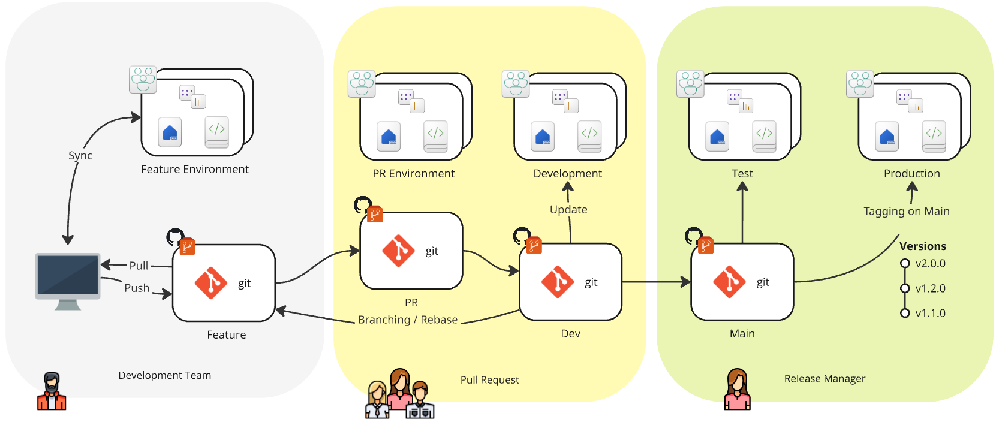

# Fabric Feature Workflow Sample Project

[Watch a recorded end-to-end demo of this setup here.](https://youtu.be/sOal9k3i3No?si=730nVPOZRJz532yJ)

## Environments

| Key | Label | Source | Deployment trigger | Lifetime | Shared | Purpose |
| --- | --- | --- | --- | --- | --- | --- |
| prod | Production | Tag | tag on `main` | Permanent | Y | Consumption by end users |
| test | UAT | Branch | push to `main` | Permanent | Y | Pre-production (business approvers) |
| dev | Development | Branch | push to `develop` | Permanent | Y | Integration (dev team) |
| pr | Pull Request/{#Number} | PR | feat => develop | Ephemeral (PR) | (Y) | Review (dev lead) |
| feat | Feature/{BranchName} | Branch | create\|delete: `feature/*` | Ephemeral (Branch) | N | Feature owner (developer) |

## Diagram

## Flow of Changes

1. Feature/*
2. develop
3. main

## Developer Workflow

- Create new feature branch (`feature/{name}`) from `main` or `dev`
  - CI/CD provisions new feature environment in Fabric
- Work in feature environment (browser or client tools)
  - Commit changes back into branch
  - Merge (any) upstream changes from `develop`
- Open pull request (target `develop`)
  - Auto-provisions PR environment
  - Review changes and push further commits
  - Closing the PR destroys the PR environment
- Merge PR
  - Review/stage changes in DEV/Integration environment
- Merge into `main`
  - Review with business stakeholders in UAT
- Tag `main` (create release)
  - Deploys to production
